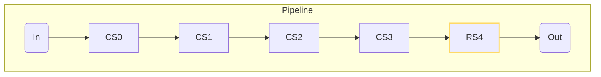
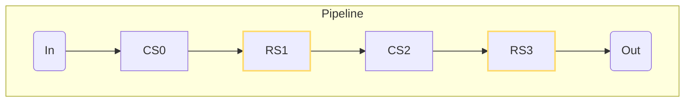
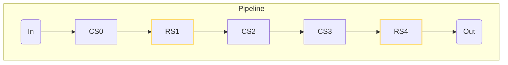
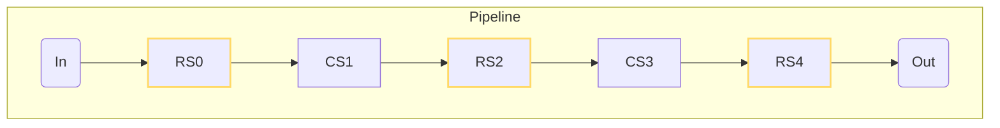
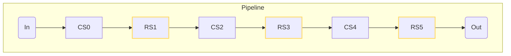

# Know-how
## Register Balancing

A register balancer should spread the register stages equally among the total stages. When choosing the place for the registers:
- Last stage should have priority over the other stages. This enables to have the right signal drive for the output
- The equally places stages should prioritize the stages closer to the input

This technique can be used in a pipeline, tree, or a network of processing elements.
### Examples
Abbreviations of the drawings:
- C: combinational
- R: registered
- S: stage

1. Scenario
 
| Total Number of Stages | Registered Stages |
| ---------------------- | ----------------- |
| 5                      | 1                 |

The "first" register is always placed at the end of the pipeline. This guarantees the best signal drive for the output.

---

2. Scenario

| Total Number of Stages | Registered Stages |
| ---------------------- | ----------------- |
| 4                      | 2                 |

The second register is placed so, that the registers are equally distributed.

---

3. Scenario

| Total Number of Stages | Registered Stages |
| ---------------------- | ----------------- |
| 5                      | 2                 |

Here, the second register is placed closer to the input. In this scenario 2 consecutive combinational stages are inevitable, it is reasonable to place the second register to stage 1, because it is not guaranteed that the input is registered.

---

4. Scenario

| Total Number of Stages | Registered Stages |
| ---------------------- | ----------------- |
| 5                      | 3                 |

5. Scenario

| Total Number of Stages | Registered Stages |
| ---------------------- | ----------------- |
| 6                      | 3                 |

# Types

# Functions

## is_stage_reg
**Brief**: Determines whether the current stage of a pipeline should be registered or not. [[#Know-how#Register Balancing]]

| Parameter | Name                   | Type | Description                                                                |
| --------- | ---------------------- | ---- | -------------------------------------------------------------------------- |
| ts        | Total Stage Count      | u32  | Total number of stages inside a pipeline                                   |
| rs        | Registered Stage Count | u32  | Required number of registered stages                                       |
| cs        | Current Stage Index    | u32  | Current stage which needs to be determined as registered or not registered |

