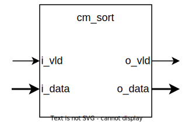

# Brief
Provides a pipelined, parallel sorting logic. Uses Batcher odd-even sorting. Lowest data goes to the lowest index.

# Parameters
| Name    | Type | Default | Range | Description                                               | Comment |
| ------- | ---- | ------- | ----- | --------------------------------------------------------- | ------- |
| DCNT    | u32  | 4       | 2..   | Number of individual data signals that needs to be sorted |         |
| DWIDTH  | u32  | 8       | 1..   | Data width of a single data signal                        |         |
| REG_CNT | u32  | 1       | 0..   | Number of registered stages                               |         |
# Ports
| Name   | Type        | Direction | Description                                   |
| ------ | ----------- | --------- | --------------------------------------------- |
| i_clk  | logic       | in        | Clock source                                  |
| i_rst  | logic       | in        | Reset                                         |
| i_vld  | logic       | in        | Input data valid                              |
| i_data | logic\[]\[] | in        | Input data array                              |
| o_vld  | logic       | out       | Output data valid                             |
| o_idx  | logic\[]\[] | out       | Indexes that belong to the corresponding data |
| o_data | logic\[]\[] | out       | Output (sorted) data array                    |
# Requirements
| Category  | ID     | Severity | Statement                                                                                                              | Comment |
| --------- | ------ | -------- | ---------------------------------------------------------------------------------------------------------------------- | ------- |
| Reset     | RST    | Shall    | On reset,                                                                          |         |
| Interface | IF_IN  | Shall    | When *i_vld* is high, the array of inputs shall be sorted                                                               |         |
| Interface | IF_OUT | Shall    | *o_vld* shall indicate a valid, sorted array                                                                           |         |
| Operation | OP_DIR | Shall    | The module shall use ascending sort. Lowest number of the input array shall go to the lowest index of the output array |         |
| Latency   | LAT    | Shall    |                                                                                                                        |         |
# Architecture
TODO