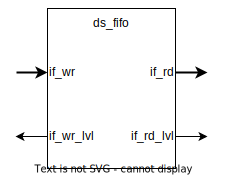
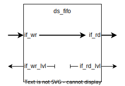
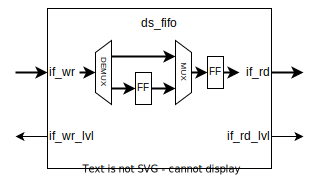
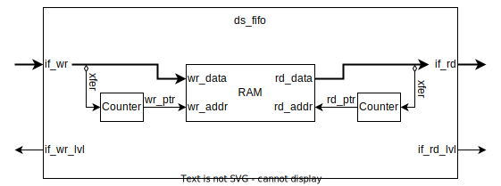
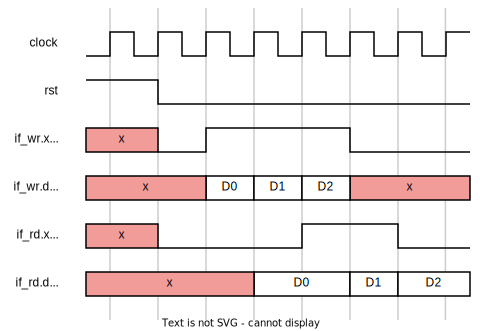

# Brief
Provides a buffer for data streams in first-in-first-out (FIFO) order, with first-word-fall-through (FWFT) behavior.

# Parameters
| Name     | Type        | Default       | Range | Description                                    | Comment                      |
| -------- | ----------- | ------------- | ----- | ---------------------------------------------- | ---------------------------- |
| CAPACITY | u32         | 8             | 0..   | Number of words that can be stored in the FIFO |                              |
| DTYPE    | type        | logic [7 : 0] | -     | Data type of a FIFO word                       |                              |
| ARCH     | t_fifo_arch | FIFO_ARCH_RAM | -     | FIFO architecture                              | [[ds_pkg#FIFO Architecture]] |
# Ports
| Name      | Type          | Direction | Description                 |
| --------- | ------------- | --------- | --------------------------- |
| i_clk     | logic         | in        | Clock source                |
| i_rst     | logic         | in        | Reset                       |
| if_wr     | [[ds_if]]     | slv       | Write data-stream interface |
| if_wr_lvl | [[cm_if_lvl]] | mst       | Write level interface       |
| if_rd     | [[ds_if]]     | mst       | Read data-stream interface  |
| if_rd_lvl | [[cm_if_lvl]] | mst       | Read level interface        |
# Modes
## Bypass Mode
**Condition**: *CAPACITY* = 0

**Attributes**:
- The FIFO is not capable to store any data, all of it's data and handshake signals are bypassed. This means that the corresponding write and read signals are connected directly.
- Level interfaces assigned to constant values, these shouldn't be used by external modules

**Usage**: In many cases it is a good idea to include a FIFO in a design. However, if it turn out that the FIFO is not required, with this mode, the instantiated FIFO can be disabled with minimal code modification.
## Half-Speed Mode
**Condition**: *CAPACITY* = 1

**Attributes**:
- The FIFO can store exactly one data. This results in alternating handshake signals, thus halving the throughput of the buffer
## Shift Register Mode
**Condition**: *ARCH* = FIFO_ARCH_SHR

**Attributes**:
- This should result in smaller resource usage, compared to the RAM mode, if the *CAPACITY* is small

**Usage**: Used for small buffers, e.g. a handshake buffer

**Note**: The number of the demultiplexer's outputs is proportional to the *CAPACITY*.
## RAM Mode
**Condition**: *ARCH* = FIFO_ARCH_RAM

This is the default FIFO mode for medium and large FIFOs.
# Requirements
| Category   | ID       | Severity | Statement                                                                                                                                                                              | Comment                        |
| ---------- | -------- | -------- | -------------------------------------------------------------------------------------------------------------------------------------------------------------------------------------- | ------------------------------ |
| Reset      | RST      | Shall    | On active reset, the FIFO shall be in empty state                                                                                                                                      |                                |
| Interface  | IF_WR    | Shall    | When write transaction conditions are met, the FIFO shall store the data of the write interface                                                                                        |                                |
| Interface  | IF_RD    | Shall    | When read transaction conditions are met, the FIFO shall provide new data on it's read interface (if it isn't empty)                                                                   |                                |
| Operation  | OP_STORE | Shall    | Shall be able to store *CAPACITY* amount of data words                                                                                                                                 |                                |
| Operation  | OP_ORD   | Shall    | Data on the read interface shall be accessible in the same order as it was received on the write interface                                                                             |                                |
| Latency    | LAT_IN   | Shall    | Shall have 1 clock cycle input latency. That means, a new data shall be stored by the FIFO in the next clock cycle                                                                     | Except in [[#Bypass Mode]]     |
| Latency    | LAT_OUT  | Shall    | Shall have 0 clock cycle output latency. That means, the last data that is stored in the FIFO shall be accessible on the read interface. This is called First-Word-Fall-Through (FWFT) |                                |
| Throughput | THP      | Shall    | Shall have 100% throughput. If the write and read transaction conditions both met, the FIFO shall not cause backpressure in either interfaces                                          | Except in [[#Half-Speed Mode]] |
## Operation Waveform
