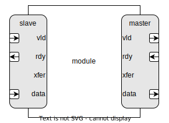

# Brief
Provides data stream interface with parametrized data type.
# Parameters
| Name  | Type | Default       | Range | Description  | Comment |
| ----- | ---- | ------------- | ----- | ------------ | ------- |
| DTYPE | type | logic [7 : 0] |       | Data type    |         |
| FC    | t_fc | FC_BI         |       | Flow-Control |         |
# Ports
| Name | Type      | Direction | Description                  |
| ---- | --------- | --------- | ---------------------------- |
| vld  | logic     | mosi      | Transmitter is ready to send |
| rdy  | logic     | miso      | Receiver is ready to receive |
| xfer | logic     | out       | A single transmission event  |
| data | data_type | mosi      | Transferred data             |
# Flow-Control
Possible values: FC_NO, FC_UNI, FC_BI
## FC_NO
Uncontrolled. There is no flow control, all data in every clock cycle is valid.
- Flow-control signals: -

## FC_UNI
Unidirectional. Only the transmitter has to initiate the transaction, the receiver can't decline.
- Flow-control signals: *vld*

## FC_BI
Bidirectional. Both blocks has to accept the transaction (handshake).
- Flow-control signals: *vld*, *rdy*

# Modport
- Master (mst): In master mode, the module that implements the interface, is the transmitter
- Slave (slv): in slave mode, the module that implements the interface, is the receiver

