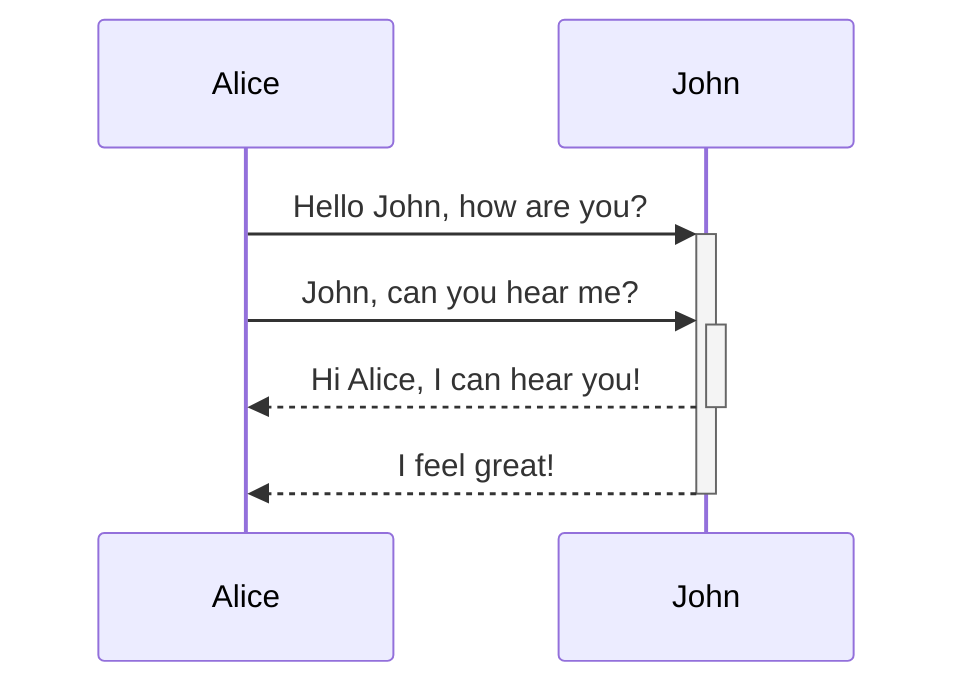
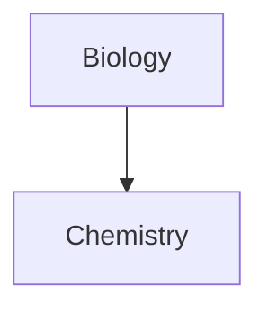

Editing and formatting in [Obsidian](https://help.obsidian.md/Editing+and+formatting/Editing+and+previewing+Markdown)

# Table

| Formatting | Syntax | Effect | Supported |
| ----------- | ----------- | ----------- | - |
| Headings | `# H1` <br /> `## H2` | Y |
| Bold | ``**bold**`` | **bold** | Y |
| Italic | `*italic*` | *italic* | Y |
| Blockquote | `> blockquote` | > blockquote | Y |
| Ordered List | `1. 1st` <br/> `2. 2nd` | Y |
| Unordered List | `- 1st` <br/> `- 2nd` | Y |
| Code | \`code\` | `code` | Y |
| ˙Horizontal Rule | `---` | --- | Y |
| Link | `[Markdown Guide](https://www.markdownguide.org)` | [Markdown Guide](https://www.markdownguide.org) | Y |
| Image | `` |  | Y |
| Table |  |  | Y |
| Fenced Code Block | \``` block \``` |  | Y |
| Footnote | `Sentence. [^1]` <br/> `[^]: Footnote` |  | Y |
| Heading ID | `# H1 {#custom-id}` |  | N |
| Definition List | `term` <br/> `: definition` |  | N |
| Strikethrough | `~~text~~` | ~~text~~ | Y |
| Task List | `- [x] i0` <br/> `- [] i2` |  | Y |
| Emoji | `:joy:` | :joy: | N |
| Highlight | `==Text==` | ==Text== | Y |
| Subscript | `H~2~O` | H~2~O | N |
| Superscript | `X^2^` | X^2^ | N |

# Effects

## Quote

> Quote
> Hi!

## Ordered List

1. First item
2. Second item
3. Third item

## Unordered List  

- First item
- Second item
- Third item

## Horizontal Rule

---
## Table

| Syntax | Description |
| ----------- | ----------- |
| Header | Title |
| Paragraph | Text |

## Fenced Code Block

```verilog
module m(
	input clk,
	input a,
	input b,
	output y
);

	always @ (posedge clk) begin
		y <= a + b;
	end

endmodule
```

[Supported Languages](https://prismjs.com/#supported-languages)

## Footnote

Here's a sentence with a footnote. [^1]
[^1]: This is the footnote.

## Strikethrough

~~Strikethrough~~

## Task List

- [x] Write the press release
- [ ] Update the website
- [ ] Contact the media

## Diagram

Example: [Obsidian Help](https://help.obsidian.md/Editing+and+formatting/Advanced+formatting+syntax)
Using [Mermaid](https://mermaid.js.org/#/) diagram







# Internal Link
[[markdown_help#Table]]

[[#Table]]

[Different Name For Reference](#Table)

