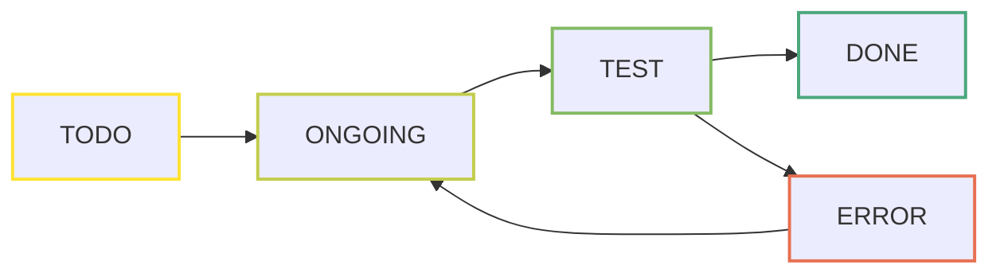

# Guide
The project is build-up of libraries, which contains modules. Each module's status shall be managed.
The structure of module management:
- library
	- **item**
		- **task**: research, design, verification... etc
			- **subtask**: requirement specification, implementation... etc
				- **phase**
That means, each item library have items, which have tasks, which have subtasks, which have phases.

Keywords to describe the phase of a subtask:

| Keyword | Description                                                                                                |
| -------:| ---------------------------------------------------------------------------------------------------------- |
|    TODO | The item is not started yet                                                                                |
| ONGOING | The item is started, it is in progress and has no known blocking issue                                     |
|    TEST | The item requires tests to be passed                                                                       |
|    DONE | The item is finished and performs correctly                                                                |
|   STUCK | Work on the item can't be continued, because of a blocking issue. E.g. a fundamental issue in an algorithm |
|   ERROR | The item is currently not working due to a failed test                                                     |

## Example flows
1. 

2. 

3. 

# lib_cm
## cm_sort
### Design
| Interface Spec. | Requirements | Design Documents | Implementation |
| --------------- | ------------ | ---------------- | -------------- |
| DONE            | TODO         | TODO             | TODO               |
## cm_arbiter
### Design
| Interface Spec. | Requirements | Design Documents | Implementation |
| --------------- | ------------ | ---------------- | -------------- |
| TODO            | TODO         | TODO             | TODO               |
# lib_ds
## ds_fifo
### Design
| Interface Spec. | Requirements | Design Documents | Implementation |
| --------------- | ------------ | ---------------- | -------------- |
| DONE            | DONE         | ONGOING          | DONE           |
### Verification
?...TODO

