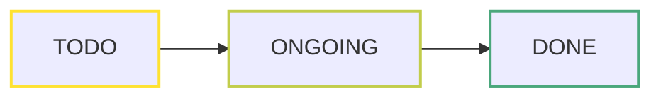
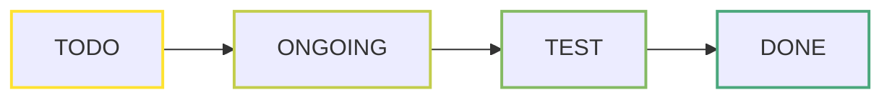
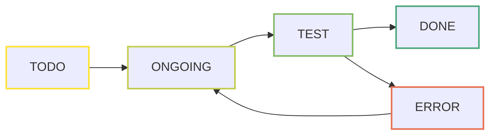

| Component       | File       | Done  | Design  | Verification | Documentation | Comment                     |
| --------------- | ---------- |:-----:| ------- | ------------ | ------------- | --------------------------- |
| Shift Register  | cm_shr.sv  | ==1== | DONE    | DONE*     | DONE          |  |
| FIFO            | ds_fifo.sv | ==1== | DONE    | DONE*        | DONE          |      |
| Sorting Network | cm_sort.sv | ==0== | DONE    | DONE         | TODO          |                             |
| Arbiter         | cm_arbiter | ==0== | ONGOING | TODO         | TODO          |                             |
\*Only the waveform is inspected, no proper test is done. Expect bugs.
# Guide
The project is build-up of libraries, which contains modules. Each module's status shall be managed.

Keywords to describe the phase of a module task:

| Keyword | Description                                                                                                |
| -------:| ---------------------------------------------------------------------------------------------------------- |
|    TODO | The item is not started yet                                                                                |
| ONGOING | The item is started, it is in progress and has no known blocking issue                                     |
|    TEST | The item requires tests to be passed                                                                       |
|    DONE | The item is finished and performs correctly                                                                |
|   STUCK | Work on the item can't be continued, because of a blocking issue. E.g. a fundamental issue in an algorithm |
|   ERROR | The item is currently not working due to a failed test                                                     |

## Example flows
1. 

2. 

3. 

